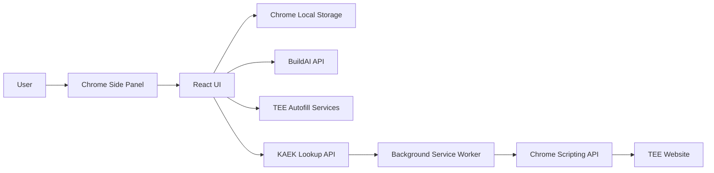

# BuildAI TEE Autofill Extension

BuildAI TEE is a Chrome browser extension designed to automatically fill supported TEE forms using project data retrieved from the BuildAI platform.

The extension provides a browser side panel where users can retrieve project information, review the available data, and automatically populate supported TEE services. It also includes an automated cadastral/geographical parcel lookup using a KAEK value.

> **Project status:** The extension is currently implemented as a Plasmo-based Chrome extension. It supports multiple TEE service autofill flows and automatic map/geographical parcel filling.

---

## Table of Contents

* [Features](#features)
* [Tech Stack](#tech-stack)
* [Extension Architecture](#extension-architecture)
* [Project Structure](#project-structure)
* [Main Components](#main-components)
* [Supported Services](#supported-services)
* [Autofill Workflow](#autofill-workflow)
* [KAEK Map Autofill](#kaek-map-autofill)
* [Chrome Permissions](#chrome-permissions)
* [Prerequisites](#prerequisites)
* [Getting Started](#getting-started)
* [Available Scripts](#available-scripts)
* [Development](#development)
* [Production Build](#production-build)
* [Packaging](#packaging)
* [Backend/API Integration](#backendapi-integration)
* [Storage](#storage)
* [Troubleshooting](#troubleshooting)
* [Development Notes](#development-notes)
* [Security Notes](#security-notes)
* [License](#license)

---

## Features

### Browser Extension

* Chrome browser extension
* Plasmo framework
* Manifest V3
* Browser side panel
* Extension action button
* React-based user interface
* Tailwind CSS styling
* TypeScript support

### Project Data

The extension can load project data from Chrome local storage.

Saved project data is displayed inside the extension side panel.

The extension shows:

* Project creator name
* Project creator email
* Project information
* KAEK property information
* Service information
* Other project values

### Autofill

The main autofill functionality automatically fills supported TEE forms.

The extension supports:

* Service-1 autofill
* Service-2 autofill
* Service-3 autofill
* Service-4 autofill

Each service has its own filling logic.

### Service-3 Autofill

Service-3 uses multiple dedicated filling functions:

* Owners
* PEA
* Permits
* Plot
* Property
* Uses

### Map / Parcel Autofill

The extension can automatically locate a property on a supported TEE map.

The workflow uses:

* KAEK
* BuildAI KAEK lookup API
* EGSA geometry coordinates
* Chrome scripting API
* Automatic form population

### User Interface

The side panel provides:

* Project data status
* User information
* Autofill button
* Parcel location button
* Back/reset button
* Success and error feedback

---

## Tech Stack

| Area               | Technology                 |
| ------------------ | -------------------------- |
| Framework          | Plasmo 0.90.5              |
| UI Library         | React 18                   |
| Language           | TypeScript                 |
| Styling            | Tailwind CSS 3             |
| Browser API        | Chrome Extension APIs      |
| Extension Standard | Manifest V3                |
| Build Tool         | Plasmo                     |
| Package Manager    | pnpm / npm                 |
| Formatting         | Prettier                   |
| CSS Processing     | PostCSS                    |
| API Communication  | Fetch API                  |
| State              | React useState / useEffect |

---

## Extension Architecture



The extension has three main parts:

1. **Side Panel**

   * Provides the main user interface.
   * Loads saved project data.
   * Starts autofill operations.

2. **Background Service Worker**

   * Handles extension messages.
   * Executes scripts inside the active browser tab.
   * Performs map field autofill.

3. **Autofill Modules**

   * Contains separate filling logic for each supported service.

---

## Project Structure

```text
autofill-extension-main/
│
├── .github/
│   └── workflows/
│       └── submit.yml
│
├── assets/
│   ├── icon.png
│   └── logo.jpg
│
├── src/
│   ├── background.ts
│   ├── sidepanel.tsx
│   ├── style.css
│   │
│   ├── components/
│   │   ├── Logo.tsx
│   │   │
│   │   ├── shared/
│   │   │   └── PrimaryButton.tsx
│   │   │
│   │   └── tabs/
│   │       ├── IntroTabs.tsx
│   │       │
│   │       ├── AutyofillTab/
│   │       │   ├── AutoFillTab.tsx
│   │       │   ├── FillScript.ts
│   │       │   ├── OwnerAutofill.ts
│   │       │   │
│   │       │   └── fillScripts/
│   │       │       ├── servicesOneFill.ts
│   │       │       ├── servicesTwoFill.ts
│   │       │       └── servicesThreeFill.ts
│   │       │
│   │       ├── allData/
│   │       │   └── AllData.tsx
│   │       │
│   │       └── autoFillMap/
│   │           └── AutoFillMap.tsx
│   │
│   └── interfaces/
│       └── global.ts
│
├── .gitignore
├── .prettierrc.mjs
├── package.json
├── pnpm-lock.yaml
├── postcss.config.js
├── tailwind.config.js
└── tsconfig.json
```

---

## Main Components

### `sidepanel.tsx`

The side panel is the main entry point of the extension UI.

It:

* Loads project data from Chrome storage.
* Maintains loading/error/data state.
* Displays the intro screen when no data exists.
* Displays the autofill interface when project data exists.

The stored data is retrieved using:

```ts
chrome.storage.local.get(["data"])
```

---

### `background.ts`

The background service worker handles extension-level operations.

It supports:

* Project fetch messages
* Map autofill messages
* Chrome scripting
* Side panel opening

The extension configures the side panel to open when the extension action is clicked.

---

### `AutoFillTab.tsx`

This is the main autofill interface.

It displays:

* Project creator name
* Masked email
* Autofill button
* Map parcel detection button

The service is selected using:

```ts
state?.data?.data?.projectData?.service?.serviceTitle
```

---

### `PrimaryButton.tsx`

A reusable button component used throughout the extension interface.

---

### `AllData.tsx`

This component can display project data values.

It also provides a copy button for individual values.

Certain internal fields are excluded from the display, including:

```text
owners
engineers
processedDocuments
service
serviceId
tokenUsage
processingStatus
createdBy
createdById
createdAt
```

---

## Supported Services

The current autofill implementation checks the service title and executes the corresponding function.

| Service   | Autofill Function            |
| --------- | ---------------------------- |
| Service-1 | `servicesOneFill()`          |
| Service-2 | `servicesTwoFill()`          |
| Service-3 | Multiple Service-3 functions |
| Service-4 | `servicesOneFill()`          |

### Service-1

```ts
servicesOneFill(projectData)
```

### Service-2

```ts
servicesTwoFill(data)
```

### Service-3

Service-3 executes:

```ts
htkOwnersFill(data)
htkPeaFill(data)
htkPermitsFill(data)
htkPlotFill(data)
htkPropertyFill(data)
htkUsesFill(data)
```

### Service-4

Service-4 currently uses the Service-1 filling logic:

```ts
servicesOneFill(projectData)
```

---

## Autofill Workflow

The general workflow is:

```text
1. User opens the extension
        ↓
2. Side panel loads
        ↓
3. Project data is loaded from Chrome storage
        ↓
4. User sees project information
        ↓
5. User clicks "Autofill"
        ↓
6. Extension identifies the service
        ↓
7. Matching autofill function is executed
        ↓
8. TEE form fields are populated
```

The service is selected using the project's service title.

If no matching service is found, the extension logs:

```text
No Service matched
```

---

## KAEK Map Autofill

The extension provides automatic parcel detection using the project's KAEK value.

The KAEK is retrieved from:

```ts
state?.data?.data?.projectData?.kaekProperty
```

The first part of the KAEK value is passed to the map component.

### KAEK API

The extension requests:

```text
https://ai.buildai.gr/api/v1/kaek_lookup?kaek={KAEK}
```

The API response is expected to contain:

```text
geometry_egsa
```

and:

```text
geometry_egsa.rings
```

The first geometry ring is converted into coordinate text.

Example format:

```text
X1 Y1,
X2 Y2,
X3 Y3
```

### Map Autofill Flow

```text
KAEK
 ↓
BuildAI KAEK API
 ↓
EGSA Geometry
 ↓
Coordinate Conversion
 ↓
Active Chrome Tab
 ↓
Background Service Worker
 ↓
Chrome Scripting API
 ↓
TEE Map Fields
```

The background script searches for:

```text
textarea[id*="GisLocation"]
```

and:

```text
input[name="GisLocation"]
```

The coordinates are inserted into matching fields.

The script also dispatches:

```text
input
change
```

events so the target website can detect the updated values.

---

## Chrome Permissions

The extension uses the following permissions:

```text
scripting
storage
sidePanel
activeTab
```

### `scripting`

Used to execute JavaScript inside the active TEE page.

### `storage`

Used to store and retrieve project data.

### `sidePanel`

Used to provide the Chrome side panel interface.

### `activeTab`

Used to interact with the currently active browser tab.

---

## Host Permissions

The extension currently declares access to:

```text
https://services.tee.gr/*
https://api.buildai.gr/*
```

The KAEK lookup implementation also communicates with:

```text
https://ai.buildai.gr/
```

Make sure the required host permission is included if the browser blocks that request.

---

## Prerequisites

Install the following before starting:

* Node.js
* pnpm or npm
* Google Chrome
* Access to the required BuildAI APIs
* Access to the supported TEE website

Recommended package manager:

```bash
pnpm
```

---

## Getting Started

### 1. Clone the repository

```bash
git clone <repository-url>

cd autofill-extension-main
```

### 2. Install dependencies

Using pnpm:

```bash
pnpm install
```

Or using npm:

```bash
npm install
```

### 3. Start development mode

```bash
pnpm dev
```

Or:

```bash
npm run dev
```

Plasmo will create a development extension build.

---

## Load Extension in Chrome

After running the development command:

1. Open Chrome.
2. Go to:

```text
chrome://extensions/
```

3. Enable **Developer mode**.
4. Click **Load unpacked**.
5. Select the generated development build directory.

For example:

```text
build/chrome-mv3-dev
```

6. Enable the extension.
7. Open the supported TEE website.
8. Click the BuildAI TEE extension icon.

---

## Available Scripts

### Development

```bash
pnpm dev
```

Starts the Plasmo development environment.

---

### Build

```bash
pnpm build
```

Creates a production extension build.

Equivalent npm command:

```bash
npm run build
```

---

### Package

```bash
pnpm package
```

Creates a packaged extension suitable for distribution.

---

## Development

The project uses Plasmo as the extension framework.

The main development flow is:

```text
React Components
        ↓
Plasmo
        ↓
Chrome Extension
        ↓
Manifest V3
```

### TypeScript

The source code is written in TypeScript.

Main TypeScript files include:

```text
src/background.ts
src/sidepanel.tsx
src/interfaces/global.ts
```

### Styling

The extension uses Tailwind CSS.

Main stylesheet:

```text
src/style.css
```

Tailwind configuration:

```text
tailwind.config.js
```

---

## Backend/API Integration

The extension communicates with BuildAI services.

### Project Fetching

The background service worker supports a message type:

```text
FETCH_PROJECT
```

The background worker receives a URL and performs:

```ts
fetch(message.url)
```

The response is converted to JSON and returned to the requesting component.

### KAEK Lookup

The map component directly requests:

```text
https://ai.buildai.gr/api/v1/kaek_lookup
```

with the KAEK query parameter.

---

## Storage

Project data is stored using Chrome local storage.

The extension reads:

```ts
chrome.storage.local.get(["data"])
```

The stored object is accessed using:

```text
data
```

When the user presses the back button, the saved data is cleared:

```ts
chrome.storage.local.set({ data: null })
```

This returns the extension to the initial screen.

---

## Data Flow

```text
Chrome Storage
      ↓
sidepanel.tsx
      ↓
FetchState
      ↓
AutoFillTab
      ↓
Project Data
      ├── Service Information
      ├── User Information
      ├── KAEK
      └── Autofill Data
```

---

## Troubleshooting

### Extension does not appear

Check:

```text
chrome://extensions/
```

Make sure:

* Developer mode is enabled.
* The correct build directory was loaded.
* The extension has no manifest errors.

---

### Development build is not created

Run:

```bash
pnpm install
```

Then:

```bash
pnpm dev
```

---

### Autofill does not work

Check:

1. The correct TEE page is open.
2. The extension has the required permissions.
3. Project data exists in Chrome storage.
4. The project contains a supported service.
5. The target TEE fields match the selectors used by the autofill scripts.

---

### Map autofill does not work

Check:

1. A valid KAEK exists.
2. The KAEK lookup API is accessible.
3. The API returns `geometry_egsa`.
4. The TEE page is the active tab.
5. The target page contains the expected `GisLocation` fields.

The extension currently searches for:

```text
textarea[id*="GisLocation"]
```

and:

```text
input[name="GisLocation"]
```

---

### No Service matched

If the extension logs:

```text
No Service matched
```

check the project's:

```text
service.serviceTitle
```

The current supported values are:

```text
Service-1
Service-2
Service-3
Service-4
```

---

## Development Notes

### Shared Components

Reusable components are located under:

```text
src/components/shared/
```

### Autofill Logic

Service-specific logic is located under:

```text
src/components/tabs/AutyofillTab/fillScripts/
```

Current files:

```text
servicesOneFill.ts
servicesTwoFill.ts
servicesThreeFill.ts
```

### Interfaces

Global interfaces are located under:

```text
src/interfaces/
```

The main state interface is:

```ts
FetchState
```

It contains:

```ts
{
  loading: boolean
  error: string | null
  data: any | null
}
```

---

## Adding a New Service

To add another service:

1. Create the service filling function.
2. Add it to the appropriate fill script.
3. Add a new case inside `handleAutofill()`.
4. Match the service title returned by the backend.

Example:

```ts
case "Service-5":
  servicesFiveFill(data)
  break
```

---

## Security Notes

### API Access

The extension communicates with external BuildAI APIs and the TEE website.

Make sure API endpoints are properly protected on the server side.

### Chrome Permissions

Only request permissions that are required by the extension.

Current permissions include:

```text
scripting
storage
sidePanel
activeTab
```

### Stored Data

Project information is stored using:

```text
chrome.storage.local
```

Review the type of project information stored there before distributing the extension publicly.

### API URLs

Avoid hardcoding sensitive credentials or private API keys inside frontend extension code.

---

## Production Build

Create a production build using:

```bash
pnpm build
```

After building, verify the generated extension before publishing.

Recommended checklist:

1. Build the extension.
2. Load the production build into Chrome.
3. Test project data loading.
4. Test each supported service.
5. Test KAEK lookup.
6. Test map autofill.
7. Verify permissions.
8. Verify API connectivity.
9. Test error handling.
10. Package the extension.

---

## Packaging

To create a distributable package:

```bash
pnpm package
```

The generated package can then be prepared for browser-store submission or internal distribution.

---

## GitHub Workflow

The repository contains a GitHub Actions workflow:

```text
.github/workflows/submit.yml
```

This workflow is related to automated extension submission using the configured Plasmo/BPP workflow.

---

## License

No license file is currently included in the project.

Add an appropriate license before distributing the extension publicly.

---

## Project Summary

BuildAI TEE provides an automated workflow for transferring project information into supported TEE forms.

The main capabilities are:

```text
Project Data
     ↓
Chrome Extension
     ↓
TEE Service Detection
     ↓
Automatic Form Filling
```

and:

```text
KAEK
 ↓
BuildAI API
 ↓
EGSA Coordinates
 ↓
Chrome Scripting
 ↓
TEE Map
 ↓
Automatic Parcel Location
```

The project is built with **Plasmo, React, TypeScript, Tailwind CSS, and Chrome Extension APIs**.

---

Built for **BuildAI TEE**.
